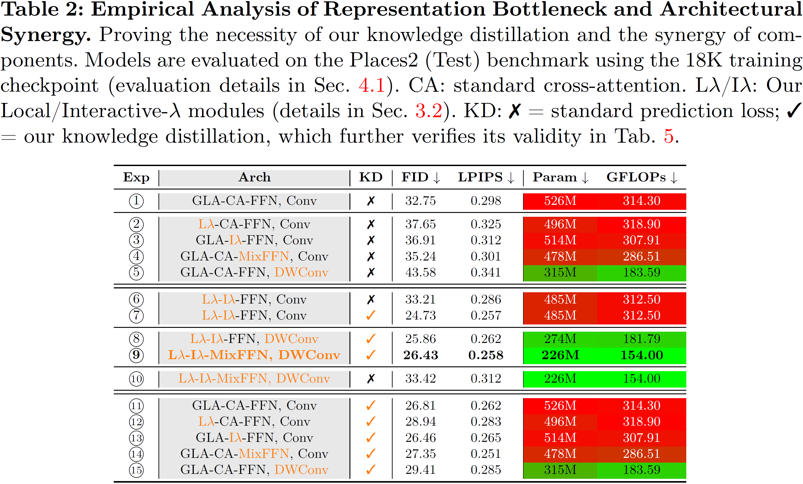

<div align="center">
    </img>
</div>

<div align="center">
<h2>Moebius: 0.2B Lightweight Image Inpainting Framework with 10B-Level Performance</h2>

***On-par-with/surpass 10B-level industrial SOTA generalist (FLUX.1-Fill-Dev) on 6 benchmarks across natural and portrait scenes & Only 2% (0.2B) parameters, and inference 15× faster***

[Kangsheng Duan](https://github.com/AnduinD)<sup>1,</sup>\*, [Ziyang Xu](https://ziyangxu.top)<sup>1,</sup>\*<sup>,&dagger;</sup>, [Wenyu Liu](http://eic.hust.edu.cn/professor/liuwenyu)<sup>1</sup>, Xiaohu Ruan<sup>2</sup>, [Xiaoxin Chen](https://scholar.google.com/citations?hl=zh-CN&user=SI_oBwsAAAAJ)<sup>2</sup>, [Xinggang Wang](https://xwcv.github.io)<sup>1, :email:</sup>

(*) Equal Contribution, (<sup>&dagger;</sup>) Project Leader, (<sup>:email:</sup>) Corresponding Author.

<sup>1</sup> Huazhong University of Science and Technology. <sup>2</sup> VIVO AI Lab.

[](https://arxiv.org/abs/2606.19195)  [](LICENSE)  [](https://hustvl.github.io/Moebius)  [](https://huggingface.co/papers/date/2026-06-19)  [](https://huggingface.co/papers/week/2026-W25)

<br>

</img>

</img>

</img>

</div>


## 🐱‍🏍 Insight & Small Talk

> ***Moebius*** *is our latest AI Image Inpainting endeavor, serving as a direct continuation of our previous work, **[PixelHacker](https://github.com/hustvl/PixelHacker)**. Named after the concepts of "infinity" and "master painter," Moebius embodies our vision: maintaining exceptional generation quality under highly constrained computational resources while pushing the efficiency of image inpainting to its limits as much as possible.*
>
> *Under the iron grip of the Scaling Law, AI research has long devolved into a grueling arms race of burning capital, compute, and data. Consequently, the academic community finds it increasingly difficult to keep pace with the ever-expanding model scales driven by the tech industry.*
>
> <p align="center"><b>"<ins>But is this brute-force scaling truly the only path forward?</ins>"</b></p>
>
> *Using general-purpose image inpainting as our strategic entry point, we challenge the "scale-at-all-costs" path dependency dictated by the Scaling Law narrative. Through the synergistic optimization of architectural design and knowledge distillation, Moebius achieves a remarkably compact footprint of just **0.22B parameters**. It liberates high-quality image inpainting from the heavy-compute narrative of 10B+ foundation models:*
> *Across six comprehensive benchmarks spanning both natural and portrait scenes, Moebius performs **on par with**, and in certain scenarios **surpasses**, the inpainting quality of 10B+ industrial state-of-the-art (SOTA) generalist models like *FLUX.1-Fill-Dev*, while delivering a massive **>15× inference acceleration**.*
>
> 💡 **The core insight of Moebius can be summarized in a single equation:**
>
> $$\begin{aligned}
> \text{Synergy} \times (\text{Architecture} + \text{Distillation}) = & \text{Shattering the "Impossible Triangle" of} \\
> & \text{Low Parameters, Fast Inference, and High Quality}
> \end{aligned}$$
>
> --- *written on June 16, 2026* ---


## 🌟 Highlights

- **📉 Extreme Parametric Efficiency (< 2%)**: Moebius operates with a mere **0.22B (226M) parameters**, which represents **less than 2%** of the size of the colossal industrial giant *FLUX.1-Fill-Dev (11.9B)*. It shatters the heavy-compute narrative, making high-quality inpainting accessible on consumer-grade and edge devices.
- **⚡ 15× Inference Speedup (26ms/step)**: Achieves a blistering inference latency of only **26.01 ms per step** on a single GPU. Combined with optimized sampling steps, Moebius delivers an overall **>15× total runtime acceleration** compared to 10B-level models.
- **🏆 10B-Level Inpainting Quality (on-par-with/surpass FLUX.1-Fill-Dev across 6 benchmarks)**: Size contraction does not mean representation degradation. Through the synergistic optimization of architecture and distillation, Moebius performs on par with, and in certain scenarios (such as complex textures and facial plausibility), surpasses 10B-level state-of-the-art (SOTA) generalist models (*FLUX.1-Fill-Dev, SD3.5 Large-Inpainting*) across 6 comprehensive benchmarks spanning **both natural** scenes (*Places2*) and **portrait** scenes (*CelebA-HQ*, *FFHQ*).
- **💡 Synergistic Core Innovations**:
  - **Architecture Design (LλMI Block)**: Reformulates both self- and cross-attention by condensing spatial context and global semantic priors into fixed-size linear matrices, bypassing quadratic computational overhead.
  - **Adaptive Multi-Granularity Distillation Strategy**: Transfers the representational capacity from our *[PixelHacker](https://github.com/hustvl/PixelHacker)* (teacher) strictly within the latent space (avoiding expensive pixel-space decoding). It bridges the giant capacity gap by aligning multi-granularity supervision—ranging from microscopic intermediate features to macroscopic diffusion trajectories—while dynamically balancing training via a gradient norm adaptive loss weighting mechanism.
  - **Optimal Synergistic Balancing**: Systematically explores the mutual constraint and upper bound between compact structure and distillation. By mapping this architecture-distillation synergy frontier, we ensure our 0.22B *Moebius* (student) absorbs the maximum semantic reasoning of *[PixelHacker](https://github.com/hustvl/PixelHacker)* (teacher) without triggering representation saturation.

<div align="center">
    </img>
</div>

- **🚀 Task-Specific Specialist over Bloated Generalists**: Rather than blindly scaling up, Moebius answers a fundamental question: *<ins>Can a model be smarter, lighter, and faster when the task is explicitly defined?</ins>* It serves as a highly optimized specialist that liberates real-world image inpainting and AI object removal from parameter bloat.

## 🔥 News
* **`June 25, 2026`:** 🎉 We are excited to share that Moebius has achieved the [No. 4 weekly ranking](https://huggingface.co/papers/week/2026-W25) (4/105) on Hugging Face. Thank you all for your support!

* **`June 19, 2026`:** 🎉 Moebius has achieved the [No. 1 daily ranking](https://huggingface.co/papers/date/2026-06-19) on Hugging Face!

* **`June 18, 2026`:** 🔥🔥 We have released the training and inference code, and open-sourced the [model weights](https://huggingface.co/hustvl/Moebius) on Hugging Face.

* **`June 18, 2026`:** 🎉 Moebius is accepted by ECCV'26! We have released the preprint on arXiv, check it [here](https://arxiv.org/abs/2606.19195) ~ 🍻

* **`June 16, 2026`:** 🔥 We have submitted the GitHub repo for the first time, and there will be more updates soon. Stay tuned! 🤗

## 🏕️ Performance on Natural Scene

<div align="center">


</img>

</img>

</div>

## 🤗 Performance on Portrait Scene
<div align="center">


</img>

</img>

</div>

## ⚖️ Evaluation Resources

The masks of the evaluation set are shared in [Google Drive](https://drive.google.com/drive/folders/13J91fdQt2RnHp4j-VzdtSrHRHPA1OxJ5?usp=sharing), and the corresponding images can be downloaded from the following open source platforms:
* Places2: [Places2](http://places2.csail.mit.edu/download-private.html)
* CelebA-HQ: [CelebA-HQ](https://openxlab.org.cn/datasets/OpenDataLab/CelebA-HQ)
* FFHQ: [FFHQ](https://drive.google.com/drive/folders/1tZUcXDBeOibC6jcMCtgRRz67pzrAHeHL?usp=drive_link)


## 📦 Environment Setups

* torch=2.7.1
* diffusers=0.38.0
* transformers=4.56.2
* flash-linear-attention=0.3.2
* See 'requirements.txt' for detailed Python libraries required

```bash
conda create -n moebius python=3.14.4
conda activate moebius
# cd /xx/xx/Moebius
pip install -r requirements.txt
```

## 🗃️ Model Checkpoints
* Download the checkpoint of [VAE](https://huggingface.co/hustvl/PixelHacker/tree/main/vae) and put it into ./weight/vae.

* Download the checkpoints of [pretrained version](https://huggingface.co/hustvl/Moebius/tree/main/pretrained), [fine-tuned version (places2)](https://huggingface.co/hustvl/Moebius/tree/main/ft_places2), [fine-tuned version (celeba-hq)](https://huggingface.co/hustvl/Moebius/tree/main/ft_celebahq), [fine-tuned version (ffhq)](https://huggingface.co/hustvl/Moebius/tree/main/ft_ffhq), and put them into ./weight/Moebius.

* Finally, the detailed organizational form is as follows:
```bash
├── weight
|   ├── Moebius
|        ├── pretrained
|            ├── diffusion_pytorch_model.bin
|        ├── ft_places2
|            ├── diffusion_pytorch_model.bin
|        ├── ft_celebahq
|            ├── diffusion_pytorch_model.bin
|        ├── ft_ffhq
|            ├── diffusion_pytorch_model.bin
|    ├── vae
|        ├── config.json
|        ├── diffusion_pytorch_model.bin
├── ...
```

<!-- * teacher model and vae: [hustvl/PixelHacker](https://huggingface.co/hustvl/PixelHacker)
* student model: [hustvl/Moebius](https://huggingface.co/hustvl/Moebius) -->

## 🚂 Training
You can run the following code to start training. The training script supports distributed training, and you can configure the GPU count via environment variables. 
```bash
# For single GPU training:
PY_TRAINER=train_distillation.py bash run/run_ddp_1node.sh config/train_demo.sh

# For multi GPU training:
NUM_GPUS_PER_MACHINE=4 bash run/run_ddp_1node.sh config/train_demo.sh
```

## 🔮 Inference
You can run the following code directly to get the inpainting result of the example image-mask pair, and the result will be generated in ./outputs. If you want to infer on custom data, just place the image and mask with the same name in ./dataset.local/imgs and ./dataset.local/masks, respectively, then run the following code as well.
```bash
python -m infer.infer_moebius \
    --model-config config/model_cfg/moebius.yaml \
    --model-weight weight/Moebius/ft_celebahq/diffusion_pytorch_model.bin \
    --real-dir data/images \
    --mask-dir data/masks \
    --save-dir ./outputs \
    --cfg 2.0 \
    --batch-size 8 \
    --num-workers 8
```


## 🎓 Citation

```shell
@misc{DuanAndXu2026Moebius,
      title={Moebius: 0.2B Lightweight Image Inpainting Framework with 10B-Level Performance},
      author={Kangsheng Duan and Ziyang Xu and Wenyu Liu and Xiaohu Ruan and Xiaoxin Chen and Xinggang Wang},
      year={2026},
      eprint={2606.19195},
      archivePrefix={arXiv},
      primaryClass={cs.CV},
      url={https://arxiv.org/abs/2606.19195}, 
}
```

## 🧑‍🤝‍🧑 Acknowledgement
We sincerely thank the authors of the following open-source repositories for their contributions to the community, which have greatly facilitated our research and development of Moebius: [Sana](https://github.com/NVlabs/Sana), [flash-linear-attention](https://github.com/fla-org/flash-linear-attention), [lambda-networks](https://github.com/lucidrains/lambda-networks), [timm](https://github.com/huggingface/pytorch-image-models), [Muon](https://github.com/KellerJordan/Muon), [diffusers](https://github.com/huggingface/diffusers).
